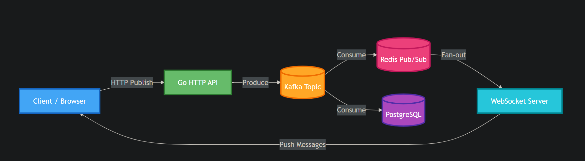

## Distributed Global Real-Time Chat System

A fault-tolerant, horizontally scalable real-time chat platform built using Golang,
Kafka, Redis, PostgreSQL, WebSockets, and Next.js. Designed around an event-driven
architecture to support thousands of concurrent users and high message throughput
with low latency.

## Architecture Overview

The system follows an event-driven, distributed architecture.

- API Gateway (Go HTTP server):
  Handles authentication, message publishing, and WebSocket upgrades.
- Kafka:
  Acts as the durable message backbone and decouples producers and consumers.
- Redis:
  Used as a low-latency fan-out layer. Each WebSocket connection subscribes
  to a Redis channel scoped by room_id.
- PostgreSQL:
  Serves as the source of truth for message persistence and user data.
- WebSocket Layer:
  Delivers messages to individual clients. Fan-out is handled by Redis,
  not by the WebSocket server.
- Next.js:
  Client-side rendering and real-time UI updates.
- Fan-out is handled entirely by Redis. The server does not maintain
  in-memory client lists or routing tables, unlike earlier in-memory
  broadcast implementations.(previous version)

## Design Decisions

- Kafka was chosen to ensure durability and replayability of messages.
- Redis is used as the fan-out layer so that each WebSocket connection
  independently receives messages for its subscribed room.
- HTTP is used for publish to keep the producer side stateless and scalable.
- WebSockets are used only for delivery. Each connected client maintains
  a single WebSocket connection subscribed to a Redis room channel.
- Database writes happen asynchronously to avoid blocking real-time delivery.

## Fault Tolerance

- Kafka ensures messages are not lost even if consumers crash.
- Redis failures do not affect message persistence.
- WebSocket disconnects do not affect message storage.
- Consumer groups allow horizontal scaling and failover.
- At-least-once delivery semantics are maintained.

## Scalability

- Stateless Go servers allow horizontal scaling.
- Kafka partitions enable parallel message consumption.
- Redis Pub/Sub performs room-based fan-out to all subscribed WebSocket connections
  across server instances.
- WebSocket connections are distributed across server instances.

## Security

- TLS-encrypted connections for Kafka and PostgreSQL.
- Secure credential management using environment variables.
- JWT-based authentication for users.
- WebSocket connections authenticated during handshake.

## Message flow (data path)

HTTP publish
→ Kafka producer
→ Kafka topic
→ (parallel)
     → Kafka → DB
     → Kafka → Redis
→ Redis (room-based Pub/Sub)
→ WebSocket connections (one per client)
 

## Running the monorepo
1) go to apps/server
2) run go mod tidy
3) go mod download
4) go to root dir and run npm install
5) run "yarn run dev"  in the root dir to start the monorepo

# Design Notes

## Per-Room Partitioning
Messages are keyed by `room_id` in Kafka, ensuring ordered delivery within each room while maintaining horizontal scalability.

## Replay on Reconnect
Kafka + PostgreSQL provide durability. If a client disconnects, missed messages are fetched from PostgreSQL on reconnect.

## Ordering Guarantee
Ordering is per room, not global. Global ordering is unnecessary — users only require correct sequence within a conversation.

## Redis Failure Scenario
Redis Pub/Sub is only for real-time fan-out. If a WebSocket server or client is down during publish, messages remain safe in Kafka/PostgreSQL and are recovered on reconnect.

## Room Membership Tracking
Message delivery does not require a centralized membership registry because Redis Pub/Sub handles fan-out to active subscribers. Presence (e.g., online users) can be optionally implemented using lightweight Redis sets with TTL/heartbeats.